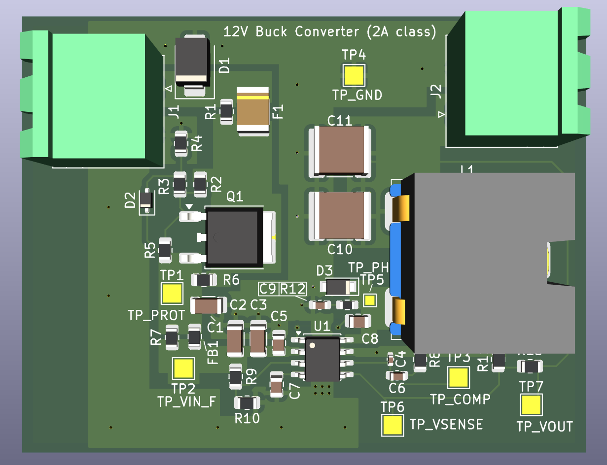

# 12V → 5V TPS54231 Buck Converter Board

2-layer switching regulator board designed to convert a 12 V input to a regulated 5 V output for embedded systems and power distribution applications.

---

## Key Specifications

Input Voltage: 10–14 V (12 V nominal)
Output Voltage: 5 V
Output Current: 2 A continuous
Switching Frequency: 570 kHz

PCB Layers: 2
Board Thickness: 1.6 mm
Copper Weight: 1 oz

---

## Features

- TPS54231 step-down switching regulator
- Optional reverse polarity protection using P-MOSFET
- Optional input fuse
- Optional EMI input filtering
- Optional switch-node RC snubber footprint
- Multiple test points for debugging and measurement
- Compensation network test points for control-loop analysis

---

## Design Highlights

- Switching **hot loop minimized** to reduce EMI
- Input and output capacitors placed close to the regulator
- Solid ground plane for low-impedance return paths
- Modular protection circuitry configurable via DNP components
- Power stage and control circuitry carefully partitioned
- Multiple measurement nodes for debugging and validation

---

## Optional Protection and Filtering

The design includes optional components that can be populated depending on system requirements.

### Reverse Polarity Protection

Populate:

- Q1
- R2, R3, R4, R5

DNP:

- R6

Optional:

- D2 (VGS clamp Zener diode)

---

### Input Fuse

Populate:

- F1

DNP:

- R1

---

### EMI Input Filtering

Populate:

- FB1

DNP:

- R7

---

### Optional Bulk Input Capacitance

Populate:

- C1

Recommended when:

- input cables are long
- supply impedance is high
- hot-plug conditions are expected

---

### Transient Protection

Populate:

- D1 (TVS diode)

Recommended for:

- automotive environments
- long power cables

---

### Snubber Network

Populate:

- R12, C9

Only required if switching node ringing or EMI is observed.

---

## Default Assembly Configuration

Populate:

- R1, R6, R7 (0 Ω jumpers)

DNP:

- F1
- Q1 and gate network
- C1
- FB1
- D1
- R12
- C9

This configuration provides the simplest VIN power path.

---

## Test Points

The board includes multiple measurement points for debugging and validation.

- **TP_PROT** – protected VIN node
- **TP_VIN_F** – filtered VIN input
- **TP_PH** – switching node
- **TP_COMP** – compensation network node
- **TP_VSENSE** – feedback sense node
- **TP_VOUT** – regulated output
- **TP_GND** – ground reference

---

## Design Notes

- TVS diode **D1** should be placed physically close to the input connector.
- Bypass jumpers allow optional protection circuits to be enabled or disabled depending on assembly configuration.
- DNP settings in the BOM determine the final assembly variant.

---

## Template Adaptation Checklist

When adapting this design for a new project:

- Verify regulator selection and ratings
- Recalculate the feedback divider for the desired output voltage
- Confirm inductor saturation current and DCR
- Review compensation network stability
- Choose the required protection and filtering options

---

## Tools

- KiCad
- 2-layer PCB layout workflow
