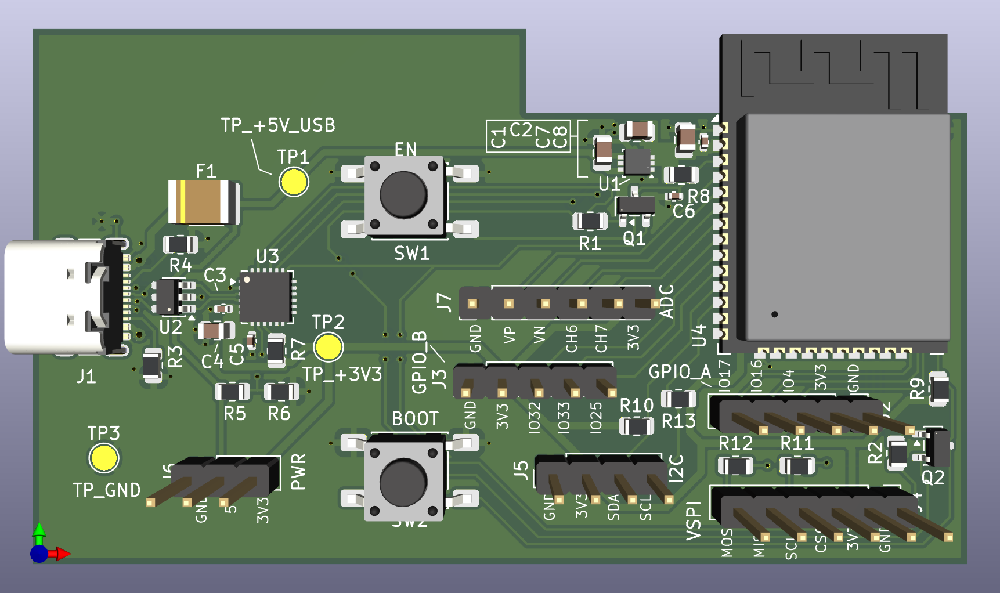

# ESP32 USB Development Board (2-Layer)

Cost-optimized 2-layer ESP32 development board designed for prototyping, embedded development, and small-scale production.

---

## Overview

This board integrates an **ESP32-WROOM module**, a **CP2102N USB-to-UART bridge**, and a **3.3 V LDO regulator** to provide a compact development platform with standard programming and debugging interfaces.

The design emphasizes **clean layout practices, manufacturability, and minimal layer count** while maintaining reliable RF and USB performance.

---

## Electrical Specifications

Input Voltage: 5 V (USB-C)
3.3 V Rail: On-board LDO regulator
Typical Current Capability: ~500 mA (Wi-Fi burst dependent)

Programming Interface: USB-UART (CP2102N)
Auto-Reset / Auto-Boot: Supported

---

## PCB Specifications

Layers: 2
Board Thickness: 1.6 mm
Copper Weight: 1 oz

### Stackup

L1 – Signal / Components
L2 – Solid Ground Plane

---

## Features

- ESP32-WROOM Wi-Fi / Bluetooth module
- CP2102N USB-to-UART bridge
- USB-C programming interface
- On-board 3.3 V LDO regulator
- Automatic bootloader programming circuit
- Input fuse on USB VBUS
- USB ESD protection device
- VSPI header
- I²C header
- GPIO expansion headers
- ADC header
- Power header (5 V / 3.3 V / GND)
- Dedicated test points for power rails

---

## Interfaces

### VSPI Header (J4)

- MOSI
- MISO
- SCLK
- CS
- 3.3 V
- GND

---

### I²C Header (J5)

- SDA
- SCL
- 3.3 V
- GND

---

### GPIO Headers

Two expansion headers expose additional ESP32 GPIO pins:

**GPIO_A**

- IO4
- IO16
- IO17

**GPIO_B**

- IO32
- IO33
- IO25

---

### ADC Header (J7)

Analog input pins from the ESP32:

- VP
- VN
- CH6
- CH7
- 3.3 V
- GND

---

### Power Header (J6)

- GND
- 5 V
- 3.3 V

Allows external peripherals to be powered from the board.

---

## Power Architecture

Power is supplied through the **USB-C connector**.

The input path includes:

1. USB-C receptacle
2. USB ESD protection device
3. Input fuse (VBUS protection)
4. 3.3 V LDO regulator
5. Local decoupling network

The ESP32 and peripherals operate from the regulated **3.3 V rail**.

---

## Programming

Programming is performed via USB using the **CP2102N USB-UART bridge**.

The board includes the standard **automatic programming circuit** used by ESP32 development boards.

Control signals:

- **DTR → EN (reset)**
- **RTS → IO0 (boot mode)**

This allows automatic firmware flashing from development tools such as:

- ESP-IDF
- Arduino IDE
- PlatformIO

---

## Test Points

The board includes measurement points for debugging and validation.

TP1 – +5V_USB
TP2 – +3V3
TP3 – GND

---

## Design Highlights

- USB differential pair routed with matched spacing
- Continuous ground plane on the bottom layer
- Proper ESP32 antenna keep-out region enforced
- Decoupling capacitors placed close to power pins
- USB shield isolated and tied to ground through a net-tie
- Auto-program circuitry located close to ESP32 control pins

---

## Tools

Designed using:

- KiCad
- 2-layer PCB layout workflow

---

## Notes

- The antenna region beneath the ESP32 module is kept free of copper to maintain RF performance.
- The bottom layer serves as a solid ground plane to improve signal return paths and reduce EMI.
- The design is intended for prototyping and small-batch manufacturing.
