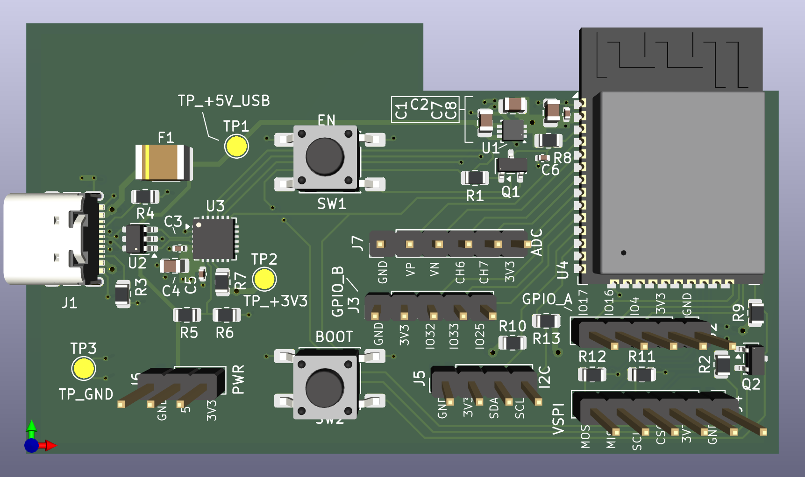

# ESP32 USB Development Board (4-Layer)

Compact ESP32 development board designed using a **4-layer PCB stackup** to improve power integrity, signal routing, and RF performance compared to a 2-layer implementation.

---

# Overview

This board integrates:

- **ESP32-WROOM-32E module**
- **CP2102N USB-to-UART bridge**
- **3.3V LDO regulator**
- **Auto-program circuit**
- Multiple expansion headers

The board is powered directly from **USB-C (5V)** and exposes common ESP32 interfaces including **SPI, I²C, ADC, and GPIO**.

This design demonstrates **production-style layout practices** including controlled USB routing, proper antenna keep-out, and multi-layer power distribution.

---

# Electrical Specifications

Input voltage
5V via USB-C

Regulated voltage
3.3V

Programming interface
USB-UART bridge (CP2102N)

Auto-program support
Yes (DTR / RTS circuit)

Typical current capability
≈500 mA (Wi-Fi burst dependent)

---

# PCB Specifications

Layers
4

Board thickness
1.6 mm

Copper weight
1 oz

---

# PCB Stackup

L1 – Components / Signals
L2 – Solid Ground Plane
L3 – 3.3V Power Plane
L4 – Signals / Ground Pour

This stackup improves:

- low impedance ground return paths
- stable power distribution
- reduced EMI
- easier signal routing

---

# Main Components

ESP32 module
ESP32-WROOM-32E

USB-UART bridge
CP2102N

Voltage regulator
LDL212 3.3V LDO

Auto-program transistors
SS8050 (Q1, Q2)

USB ESD protection
USBLC6-2SC6

USB input fuse
0603 resettable fuse

---

# Features

- ESP32 Wi-Fi / Bluetooth module
- USB-C programming interface
- CP2102N USB-UART bridge
- 3.3V on-board LDO regulator
- Automatic programming circuit
- USB input protection
- ESD protection on USB lines
- SPI header
- I²C header
- ADC header
- GPIO expansion headers
- Power header
- Dedicated test points

---

# Interfaces

## VSPI Header (J4)

- MOSI
- MISO
- SCLK
- CS
- 3V3
- GND

---

## I²C Header (J5)

- SDA
- SCL
- 3V3
- GND

---

## GPIO Header A (J2)

- IO4
- IO16
- IO17
- 3V3
- GND

---

## GPIO Header B (J3)

- IO32
- IO33
- IO25
- 3V3
- GND

---

## ADC Header (J7)

- SENSOR_VP
- SENSOR_VN
- ADC_CH6
- ADC_CH7
- 3V3
- GND

---

## Power Header (J6)

- GND
- 5V
- 3V3

---

# Power Architecture

Power enters the board through the **USB-C connector**.

Power path:

1. USB-C connector
2. Input fuse
3. ESD protection device
4. LDL212 3.3V LDO regulator
5. Local decoupling network

The **3.3V plane on Layer 3** distributes power to the ESP32 and peripherals.

The **Layer 2 ground plane** provides a continuous low-impedance return path.

---

# Programming

Firmware is uploaded through the **CP2102N USB-UART bridge**.

The board includes the standard ESP32 **auto-program circuit** using DTR and RTS signals.

Control signals:

DTR → EN (reset)
RTS → IO0 (boot mode)

Compatible with:

- ESP-IDF
- Arduino IDE
- PlatformIO

---

# Test Points

TP1 – +5V_USB
TP2 – +3V3
TP3 – GND

These allow easy probing of power rails during debugging.

---

# Design Highlights

- 4-layer PCB architecture
- Dedicated internal ground plane
- Internal 3.3V power plane
- Proper ESP32 antenna keep-out
- Short decoupling loops for ESP32 power pins
- Controlled routing of USB differential pair
- Clean separation between RF region and routing
- Auto-program circuit located close to ESP32 pins
- USB ESD protection located near connector

---

# Tools

Designed using:

KiCad PCB Design Suite

---

# Notes

The ESP32 antenna region is kept free of copper on all layers to maintain RF performance.

The 4-layer architecture allows:

- cleaner routing
- improved power integrity
- better EMI performance

This project demonstrates a **compact multi-layer ESP32 development board suitable for embedded prototyping**.
