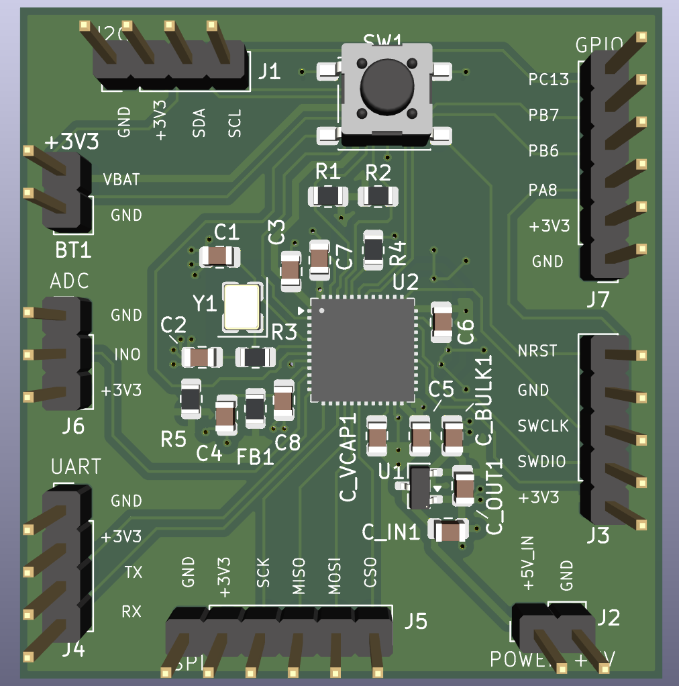

# STM32F411 Development Board

Custom STM32F411 microcontroller development board designed for embedded firmware development and peripheral interfacing.

---

## Specifications

Version: v1.0
MCU: STM32F411CEUx
PCB Layers: 2
Board Thickness: 1.6 mm
Copper Weight: 1 oz

---

## Features

- STM32F411 Cortex-M4 microcontroller
- SWD programming/debug interface
- External 16 MHz crystal oscillator
- MCP1700 3.3 V LDO regulator
- Dedicated VDDA analog filtering using ferrite bead
- SPI interface header
- I2C interface header
- UART interface header
- ADC input header
- GPIO breakout header
- User push button (NRST)

---

## Design Highlights

- Solid bottom ground plane for signal integrity
- Compact decoupling capacitor placement near MCU supply pins
- Short crystal oscillator routing for stable clock operation
- Separate analog supply filtering for VDDA
- Organized peripheral header layout for easy prototyping
- Clear separation between power distribution and signal routing

---

## Interfaces

| Interface | Header |
|-----------|--------|
| SWD Debug | J3 |
| I2C | J1 |
| SPI | J5 |
| UART | J4 |
| ADC | J6 |
| GPIO | J7 |
| Power Input | J2 |

---

## Power Architecture

- Input power via **+5V header**
- **MCP1700 LDO** regulates to 3.3 V
- Local decoupling network for MCU supply pins
- Ferrite bead isolation for **VDDA analog supply**

---

## Tools

- KiCad
- 2-layer PCB layout workflow
